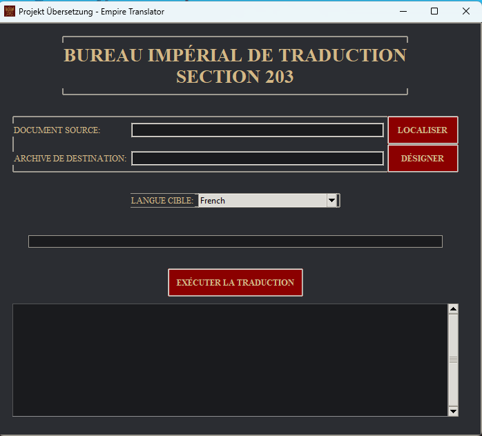

# Empire Translator - Traduction PDF avec Interface Graphique

**Empire Translator** est une application de traduction de documents PDF avec une interface graphique élégante inspirée de l'univers de *Tanya the Evil*. Elle permet aux utilisateurs de traduire facilement des fichiers PDF dans différentes langues tout en conservant leur mise en page.

---

## Fonctionnalités

- Traduction de documents PDF en plusieurs langues.
- Interface graphique immersive avec un style impérial.
- Prise en charge des langues courantes comme l'allemand, le japonais, le français, l'anglais, le russe, et l'italien.
- Conversion automatique des fichiers PDF en Word avant traduction.
- Gestion des erreurs et affichage des logs en temps réel.

---

## Structure du Projet

```
pdf-translator-gui
├── src
│   ├── main.py                # Point d'entrée principal
│   ├── gui
│   │   ├── __init__.py
│   │   ├── window.py          # Interface graphique
│   │   └── assets             # Ressources (icônes, images)
│   ├── translation
│   │   ├── __init__.py
│   │   └── translator.py      # Logique de traduction
│   └── utils
│       ├── __init__.py
│       └── file_handler.py    # Gestion des fichiers
├── tests
│   ├── __init__.py
│   └── test_translator.py     # Tests unitaires
├── requirements.txt           # Dépendances Python
├── build_exe.py               # Script pour créer un exécutable
└── README.md                  # Documentation
```

---

## Installation

### Prérequis

- **Python 3.10+** doit être installé sur votre machine.
- Installez les dépendances nécessaires avec `pip`.

### Étapes d'installation

1. Clonez le dépôt :
   ```bash
   git clone <url-du-dépôt>
   cd pdf-translator-gui
   ```

2. Installez les dépendances :
   ```bash
   pip install -r requirements.txt
   ```

3. Assurez-vous que le fichier `icon.ico` est présent dans `src/gui/assets`.

---

## Utilisation

### Lancer l'application

Pour démarrer l'application, exécutez le fichier `main.py` :
```bash
python src/main.py
```

### Traduire un document PDF

1. Sélectionnez un fichier PDF source.
2. Choisissez un fichier de sortie (format `.docx`).
3. Sélectionnez la langue cible dans la liste déroulante.
4. Cliquez sur **"EXÉCUTER LA TRADUCTION"** pour démarrer le processus.

---

## Création d'un exécutable

Pour créer un fichier `.exe` exécutable (Windows) :

1. Assurez-vous que PyInstaller est installé :
   ```bash
   pip install pyinstaller
   ```

2. Exécutez le script `build_exe.py` :
   ```bash
   python build_exe.py
   ```

3. L'exécutable sera généré dans le dossier `dist`.

---

## Contribuer

Les contributions sont les bienvenues ! Voici comment vous pouvez aider :

1. Forkez le projet.
2. Créez une branche pour vos modifications :
   ```bash
   git checkout -b feature/ma-fonctionnalite
   ```
3. Soumettez une pull request.

---

## Dépendances

Les bibliothèques suivantes sont utilisées dans ce projet :

- **tkinter** : Interface graphique.
- **Pillow** : Gestion des images.
- **pdf2docx** : Conversion des fichiers PDF en Word.
- **deep-translator** : Traduction automatique.
- **PyInstaller** : Création d'exécutables.

Installez-les avec :
```bash
pip install -r requirements.txt
```

---

## Captures d'écran

### Interface principale
